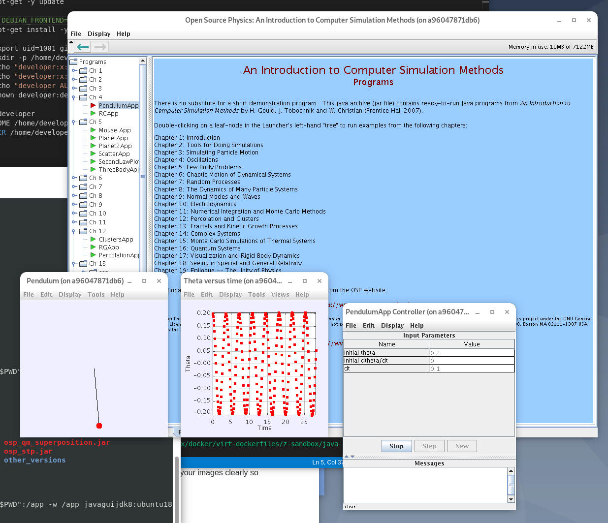
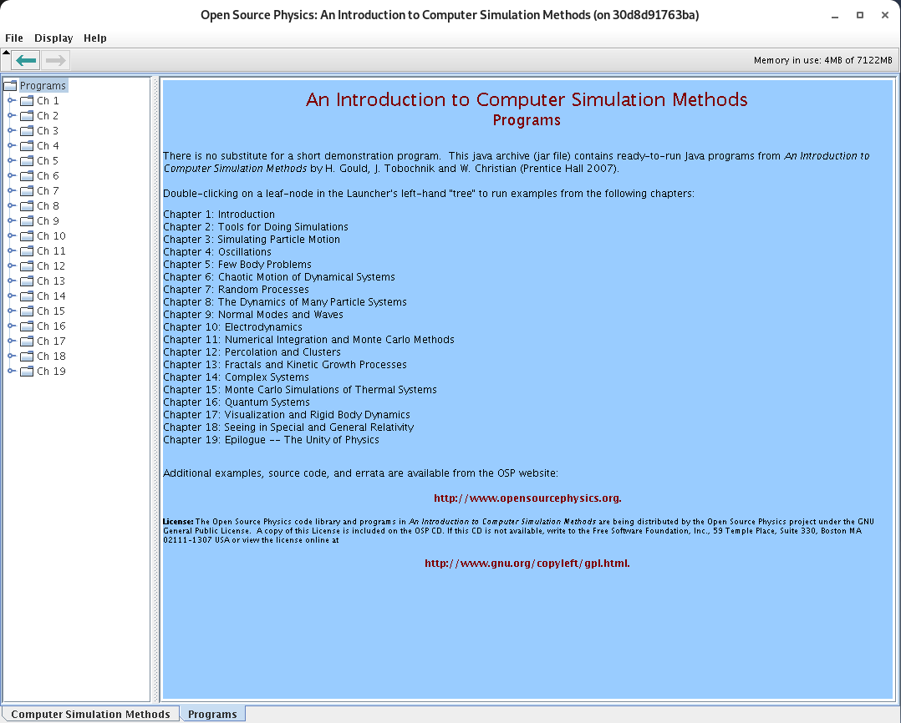

# Running Java GUI jars from a Docker container

## Building a Java container that allows an X window

We build our container based on an Oracle JDK-8 in Ubuntu 18.04. We add the user `developer` that will allows to set up an **X** session. We also install some X libraries such `libxext`, `libxrender`, `libxtst`. If these libraries are not installed the GUI will throw errors such as 

```
Exception in thread "main" java.lang.UnsatisfiedLinkError: /opt/java-jdk/jdk1.8.0_231/jre/lib/amd64/libawt_xawt.so: libXrender.so.1: cannot open shared object file: No such file or directory
```

or

```
Exception in thread "main" java.lang.UnsatisfiedLinkError: /opt/java-jdk/jdk1.8.0_231/jre/lib/amd64/libawt_xawt.so: libXtst.so.6: cannot open shared object file: No such file or directory
```

Once the container is run we should be able to run a Java `jar` applications such as any of the Open Source Physics simulations as shown here:



This is the simulation `PendulumApp` part of the set of applications contained in `osp_csm.jar` file.

The main reason of having a container to run these Java applications is to making independent of the host machine, which could contain or not its own Java. Sometimes the Java settings in the host machine may not work or be ready to run. With the container with avoid this.

## The X enabled Java container

The container is very simple. Only few lines to install the X libraries and adding a user for the X session.

```dockerfile
FROM f0nzie/oracle-java-8:ubuntu18

RUN apt-get -y update

# RUN DEBIAN_FRONTEND=noninteractive
RUN apt-get install -y libxext-dev libxrender-dev libxtst-dev

RUN export uid=1001 gid=1001 && \
    mkdir -p /home/developer && \
    echo "developer:x:${uid}:${gid}:Developer,,,:/home/developer:/bin/bash" >> /etc/passwd && \
    echo "developer:x:${uid}:" >> /etc/group && \
    echo "developer ALL=(ALL) NOPASSWD: ALL" > /etc/sudoers && \
    chown developer:developer -R /home/developer

USER developer
ENV HOME /home/developer
WORKDIR /home/developer
```

## Build the container

To build the container we type from the terminal where the Dockerfile `ubuntu18.Dockerfile` is located:

```
 docker build -f ubuntu18.Dockerfile -t f0nzie/javaguijdk8:ubuntu18 .
```

## Run the container

In this example, this line will run the `jar` file `osp_csm.jar`:

```
docker run -ti --rm -e DISPLAY=$DISPLAY -v /tmp/.X11-unix:/tmp/.X11-unix -v "$PWD":/app -w /app f0nzie/javaguijdk8:ubuntu18 java -jar osp_csm.jar
```

This is a screenshot of the main application that contains dozens of computer simulation applications.



This `docker run` line is different from the typical because it exposes an X window session and gives us a volume to temporarily host the Java application:

`-e DISPLAY=$DISPLAY`: passes the local display as an environment variable to the container

`-v /tmp/.X11-unix:/tmp/.X11-unix`: sets up a volume to allow a connection to the X session 

`-v "$PWD":/app -w /app`: enables a volume to allocate the Java application

## Open Source Physics simulations

All the simulation applications can be found in <https://www.compadre.org/osp/>

The one in the example (`osp_csm.jar`) can be downloaded from here [An Introduction To Computer Simulation Methods Examples](https://www.compadre.org/OSP/items/detail.cfm?ID=7154).

​	

​	


|                                   |                                                              |
| --------------------------------- | ------------------------------------------------------------ |
| `osp_csm.jar`                     | [An Introduction To Computer Simulation Methods Examples](https://www.compadre.org/OSP/items/detail.cfm?ID=7154) |
| `osp_guide.jar`                   | [OSP User's Guide Examples](https://www.compadre.org/osp/items/detail.cfm?ID=7153) |
| `osp_v2.3a_eclipse_workspace.zip` | [Open Source Physics Eclipse Workspace](https://www.compadre.org/OSP/items/detail.cfm?ID=7147) |
| `CSM3rd_revised.pdf`              | [An Introduction to Computer Simulation Methods Third Edition (revised)](https://www.compadre.org/OSP/items/detail.cfm?ID=7375) |
| `osp_ode_examples.jar`            | [Solving Ordinary Differential Equations](https://www.compadre.org/osp/items/detail.cfm?ID=9348) |
| `mech_helium.jar`                 | [Classical helium](https://www.compadre.org/osp/document/ServeFile.cfm?ID=7209&DocID=375) |
| `osp_demo.jar`                    | [Demo Package](https://www.compadre.org/osp/items/detail.cfm?ID=7293) |


